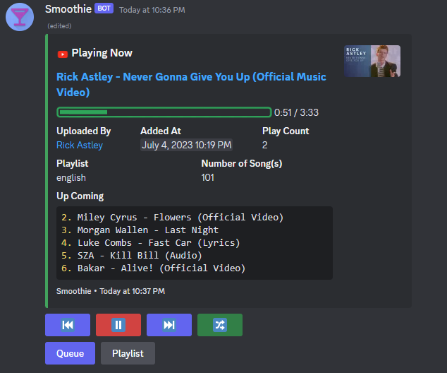
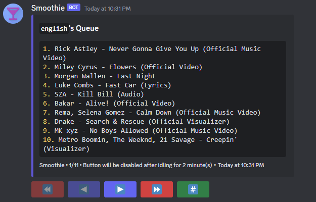
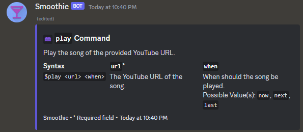
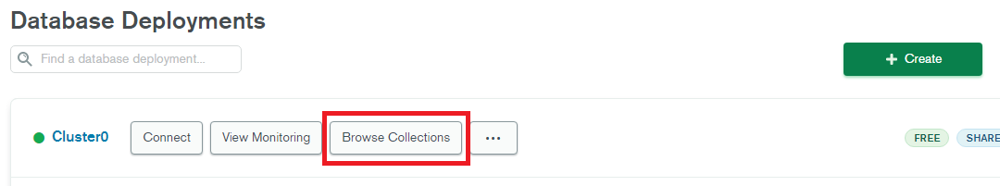
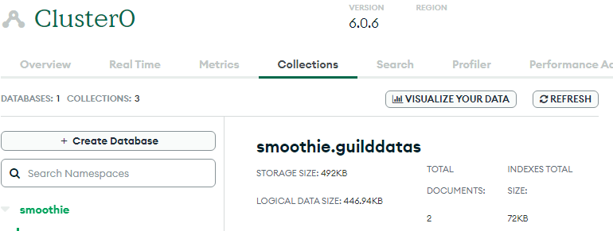
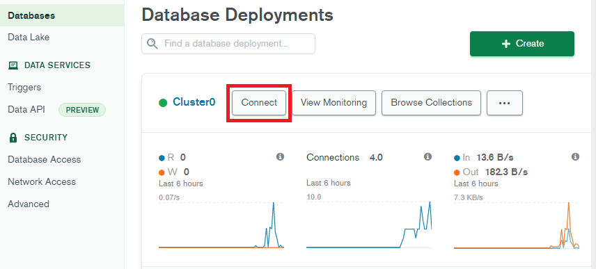

# Smoothie :musical_note:

A discord.js v14 music bot that uses Typescript, Node.js, MongoDB. Support deploying in Heroku.  

## Feature Highlight :rotating_light:

-   Support tranditional prefix command (default: `$`) or slash command.
-   Command aliases.
-   Multilanguage (Feel free to contribute and add more languages!).
-   Support YouTube single video and playlist (and YouTube music).
-   Automatically rejoin the voice channel when the bot has restarted (so the bot can stay in the voice channel 24/7).
-   Automatically pause / unpause when there is no one in the voice channel / someone joins the voice channel.
-   Playlist system: You can switch between playlists easily.
-   Playing now message with progress bar.  
    
-   Queue system: See which song is coming next!  
    
-   Ranking system: Compete with your friends to see who can stay in the voice channel the longest!
-   Help command: Help you understand more about each command.  
    

## Commands :keyboard:

\* Aliases only work on prefix command. It does not work on slash command.

### General

| Command                  | Aliases   | Description                                      |
| ------------------------ | --------- | ------------------------------------------------ |
| `help`                   | /         | Provide information on other commands.           |
| `language`               | `lang`    | Show / Change language.                          |
| `ping`                   | /         | Reply with pong!                                 |
| `prefix`                 | `pre`     | Show / Change prefix.                            |
| `rank`                   | `ranking` | Show some ranking within the guild.              |
| `stayRank` / `rank stay` | /         | Show the ranking of voice channel stay duration. |

### Music

| Command                              | Aliases                          | Description                                                                            |
| ------------------------------------ | -------------------------------- | -------------------------------------------------------------------------------------- |
| `createPlaylist` / `playlist create` | `addplaylist`                    | Create a new playlist.                                                                 |
| `infoPlaylist` / `playlist info`     | /                                | Show the info of a playlist.                                                           |
| `listPlaylist` / `playlist list`     | `listplaylists` / `showplaylist` | List all the playlists.                                                                |
| `removePlaylist` / `playlist remove` | `deleteplaylist`                 | Remove a playlist.                                                                     |
| `switchPlaylist` / `playlist switch` | /                                | Switch to another playlist.                                                            |
| `playlist`                           | /                                | Remove / Create / Show / Switch to / List / playlist.                                  |
| `join`                               | /                                | Join your voice channel.                                                               |
| `leave`                              | /                                | Leave your voice channel.                                                              |
| `pause`                              | `stop`                           | Pause the current song.                                                                |
| `play`                               | /                                | Play the song of the provided YouTube URL.                                             |
| `prev`                               | `previous`                       | Play the previous song.                                                                |
| `queue`                              | /                                | Show the queue of the current playlist.                                                |
| `queueRank` / `rank queue`           | /                                | Show the ranking of the number of times played of each song in the current queue.      |
| `remove`                             | `delete`                         | Remove a song from the list.                                                           |
| `retry`                              | `replay`                         | Try to play the first song again. Useful when there was error playing the song before. |
| `search`                             | /                                | Search songs from your queue.                                                          |
| `shuffle`                            | /                                | Shuffle the current queue.                                                             |
| `skip`                               | /                                | Skip the current song.                                                                 |
| `unpause`                            | `resume`                         | Unpause the current song.                                                              |

## Environment Variable :keyboard:

Put these value in `.env` file.

| Environmental Variable | Required? | Description                                                                                                                                                                                                                                                                                                                                                                                       |
| ---------------------- | --------- | ------------------------------------------------------------------------------------------------------------------------------------------------------------------------------------------------------------------------------------------------------------------------------------------------------------------------------------------------------------------------------------------------- |
| `BOT_TOKEN`            | Yes       | Can be found in developer portal (`Bot` -> `TOKEN`).                                                                                                                                                                                                                                                                                                                                              |
| `CLIENT_ID`            | Yes       | Can be found in developer portal (`OAuth2` -> `General` -> `CLIENT ID`).                                                                                                                                                                                                                                                                                                                          |
| `GUILD_ID`             | No        | Used in `register-guild-commands`, `clear-guild-commands`, `import-songs` scripts.                                                                                                                                                                                                                                                                                                                |
| `MONGODB_URL`          | Yes       | The URL of your MongoDB database (more detail below).   Please remove everything after the last `/`, including the `/`.   For example: For `mongodb+srv://<username>:<password>@cluster0.9mmia.mongodb.net/<database_name>?retryWrites=true&w=majority`, remove `/<database_name>?retryWrites=true&w=majority` (i.e.: `mongodb+srv://<username>:<password>@cluster0.9mmia.mongodb.net`) |
| `ENV`                  | Yes       | Can be `dev`, `prod`, or `debug`. If you do not know what this is, just choose `prod`.                                                                                                                                                                                                                                                                                                            |
| `YOUTUBE_COOKIE`       | No        | If you encounter `Sign in to confirm you’re not a bot`, you will need fill in this variabel. See [Toubleshooting](#troubleshooting).                                                                                                                                                                                                                                                              |

## Setting up MongoDB :factory:

1.  Register a [MongoDB Altas](https://www.mongodb.com/cloud/atlas/register) account.
2.  Create a cluster.
3.  On `Databases` tab, click `Browse Collections`.  
    
4.  Click `Add My Own Data`.
5.  Create a database named `smoothie`.  
    
6.  On the left, click `Database Access`. Then click `ADD NEW DATABASE USER`.
7.  Click `Password` as `Authentication Method` and type in `user` (e.g. `user1`) and password (e.g. `user1234`) (Use more secure password!). Click `Read and write to any database` in `Build-in Role` and finally click `Add User`.
8.  On the left, click `Network Access`. Then click `ADD IP ADDRESS`.
9.  Type in `0.0.0.0/0` in `Access List Entry` and `All` in `Comment` and click `Confirm`. This will enable Heroku to access your database. (`0.0.0.0/0` will able all IP to access you database).
10. Go to `Databases` page and click `Connect` in your cluster tab.  
    
11. Click `Connect your application`.
12. Choose the `Drivers` as `Node.js` and `VERSION` as `4.0 or later`.
13. Copy the URL in step 2.
14. Replace `<password>` with the password you just entered (e.g. `user1234`) and replace `<username>` with the user you just entered (e.g. `user1`).
15. Please remove everything after the last `/`, including the `/`. For example: For `mongodb+srv://<username>:<password>@cluster0.9mmia.mongodb.net/<database_name>?retryWrites=true&w=majority`, remove `/<database_name>?retryWrites=true&w=majority` (i.e.: `mongodb+srv://<username>:<password>@cluster0.9mmia.mongodb.net`).
16. The URL will be the value of the environment variable `MONGODB_URL`!

## Hosting on Heroku :cloud:

\* As of today, the free dynos of Heroku is no longer available. However, if you are a student and joined [Github Education](https://education.github.com/students), you can apply for [Heroku for Students](https://www.heroku.com/students) to host the bot for free.

1. Fork this repository.
2. Register an account in [Heroku](https://id.heroku.com/login).
3. Create a new app.
4. Go to `Deploy` tap. Click Github as your deployment method.
5. Link your Github account to Heroku.
6. Choose the repository that you forked. Choose the `main` branch.
7. Enable automatic deploy.
8. Wait for the deploy to finish.
9. Go to `Resources` tab. In `Free Dynos` section, disable `web` and turn on `Worker`.
10. Go to `Settings` tab. Click `Reveal Config Vars`. Put all the environment variables and its values here (See `Environment Variable` section from above).
11. On right hand corner, click `More` and then click `Run console`.
12. In the console, type `npm run register-global-commands` to register slash commands globally.
13. On right hand corner, click `More` and then click `Restart all dynos`.
14. Click `More` once again and click `View logs`. You should see the bot has been successfully hosted! Congratulations!

## Troubleshooting

### Sign in to confirm you’re not a bot

-   If you face `Sign in to confirm you’re not a bot` error, you need provide a YouTube cookie.

> [!WARNING]  
> It is strongly suggested that you create a new account to do this instead of using your personal account.

1. Open a random YouTube video with your new account.

2. Open developer tools (`Option + ⌘ + J` (on macOS), or `Shift + CTRL + J` (on Windows/Linux)).

3. Open **Network** tab.

4. Reload the page. Find and open the first request (which is HTTP GET Request of the webpage).

5. Scroll down and find Request Headers. Find `Cookie` attribute.

6. Copy its value to `.env` file. Wrap your cookie with double quotation marks. (e.g. `YOUTUBE_COOKIE="<your cookie here>"`).

> [!WARNING]  
> Do not logout your YouTube account as it would expire your cookie. Alternatively, you can delete the cookie.

## Contributing

All pull requests are welcome.

Please follow the `fork-and-pull` Git workflow.

If you want to contribute to translation, you can take [src/i18n/en-US.ts](src/i18n/en-US.ts) as a reference.

## License

Smoothie is licensed under the [GNU General Public License v3.0](LICENSE).
